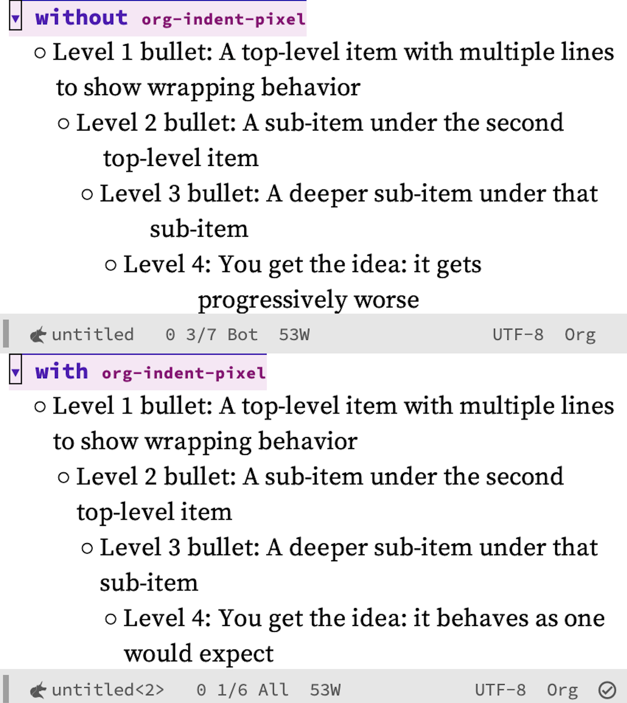

# `org-indent-pixel`: Pixel-accurate wrap-prefix for variable-pitch Org buffers

## Overview

When `org-indent-mode` and `buffer-face-mode` (or `variable-pitch-mode`) are both active, wrapped lines in nested list items become progressively misaligned. The deeper the nesting, the worse the drift. This happens because `org-indent-mode` builds its `wrap-prefix` from fixed-width space characters, which are narrower than the average character in a variable-pitch font.



`org-indent-pixel` fixes this by replacing the space-based `wrap-prefix` with a pixel-accurate specification. For each indented non-heading line, it measures the actual rendered width of the line content and prefix in the buffer's variable-pitch font---including any display properties set by packages like [org-modern](https://github.com/minad/org-modern)---and sets `wrap-prefix` to an exact pixel value. The result is that continuation lines align precisely with the body text above, regardless of the font in use.

The package requires a graphical Emacs frame; in a terminal all characters occupy the same width, so the built-in space-based prefix is already correct. Users of [mixed-pitch](https://gitlab.com/jabranham/mixed-pitch) typically do not need this package either, since `mixed-pitch` keeps indentation in a fixed-pitch face where the space-based prefix remains accurate.

## Installation

`org-indent-pixel` requires GNU Emacs 29.1 or later and Org 9.6 or later. There are no dependencies beyond these built-in packages.

### package-vc (built-in since Emacs 30)

```emacs-lisp
(use-package org-indent-pixel
  :vc (:url "https://github.com/benthamite/org-indent-pixel"))
```

### Elpaca

```emacs-lisp
(use-package org-indent-pixel
  :ensure (:host github :repo "benthamite/org-indent-pixel"))
```

### straight.el

```emacs-lisp
(use-package org-indent-pixel
  :straight (:host github :repo "benthamite/org-indent-pixel"))
```

## Quick start

Call `org-indent-pixel-setup` once in your init file. It registers hooks so that `org-indent-pixel-mode` activates automatically in any Org buffer where both `org-indent-mode` and `buffer-face-mode` are active.

```emacs-lisp
(use-package org-indent-pixel
  :ensure (org-indent-pixel :host github :repo "benthamite/org-indent-pixel")
  :init
  (org-indent-pixel-setup))
```

If you change your variable-pitch font while the mode is active, toggle it off and back on (`M-x org-indent-pixel-mode` twice) to force a full reprocessing.

## Documentation

For a comprehensive description of all user options, commands, and functions, see the [manual](README.org).

## License

`org-indent-pixel` is free software distributed under the [GNU General Public License, version 3](COPYING.txt) or later.
